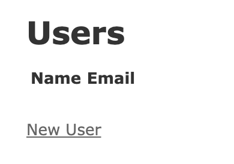

# Rails入門 01

> Railsとは、Rubyプログラミング言語で書かれたWebアプリケーションフレームワークです。 Railsは、あらゆる開発者がWebアプリケーションの開発を始めるうえで必要となる作業やリソースを事前に仮定して準備しておくことで、Webアプリケーションをより簡単にプログラミングできるように設計されています。

- https://railsguides.jp/getting_started.html

Railsの思想を知るにはRails Doctrine(Railsの基本原則)を読むと良いでしょう。

- https://rubyonrails.org/doctrine/
  - 翻訳(旧版の翻訳なので原則の数が1つ少ない) https://postd.cc/rails-doctrine/

## Railsアプリケーションの作成

Railsを理解するには実際にRailsアプリケーションを作成し、そのコードを読みながら理解していくのがはやいでしょう。まずは以下のコマンドを実行してみてください。実行するとアプリケーションの雛形が生成され、必要なライブラリのインストールが始まります。

```sh
$ rails new one-day-web-application -d postgresql
```

上記のコマンドはアプリケーション名が「one-day-web-application」という名前で、データベースはPostgreSQLを使用するRailsアプリケーションの雛形を生成せよという命令です。実行が終わると「one-day-web-application」というディレクトリが生成されているのでそちらにcdしておきましょう。以後、アプリケーションのrootにいる前提で話をすすめていきます。

```sh
$ cd one-day-web-application
```

## MVCフレームワーク

RailsはMVCパターンを採用しているWebフレームワークです。MVCはModel、View、Controllerの略でWebアプリケーションが3つのレイヤーで構成されるアーキテクチャパターンです。

それぞれの責務は以下の通りです。

- Model
  - データ層へのアクセスやビジネスロジックを担当
  - Railsではモデルとデータベースのテーブルが1:1で対応する
- View
  - 表示する画面そのものや、表示に関わるロジックを担当
- Controller
  - クライアントからの入力を受け取り、出力を返すための制御を担当


Railsではモデル、ビュー、コントローラはそれぞれディレクトリがわかれてファイルが保存されています。appディレクトリ以下がアプリケーションを構成する主要なコード郡ですが、更にその下にcontrollers、models、viewsとディレクトリがありそこにそれぞれのコードが保存されています。

```
app/ # アプリケーションの主要なコード郡
  controllers/ # コントローラー
  models/ # モデル
  views/ # ビュー
```

他にも様々なディレクトリが生成されていますが、それらについては適宜説明をしていきます。

## Scaffoldを実行する。

RailsアプリケーションにはScaffoldと呼ばれるモデル、ビュー、コントローラーを一括で生成する機能があります。このコマンドでユーザーのCRUD(Create, Read, Update, Delete)機能を生成してみましょう。

```sh
$ bin/rails g scaffold user name:string email:string # 雛形の生成
$ bin/rails db:create # データベースの生成
$ bin/rails db:migrate # マイグレーションの実行(今回はテーブルの作成が行なわれる)
$ bin/rails s # サーバーの起動
```

ここまで無事に実行できたら [http://localhost:3000/users](http://localhost:3000/users) にアクセスしてみましょう。ユーザーの一覧ページが表示されるはずです。



「New User」をクリックするとユーザーの登録フォームが表示されるのでデータを登録してみましょう。

登録することができたら再度一覧ページに戻りデータが表示されていることを確認してみてください。
